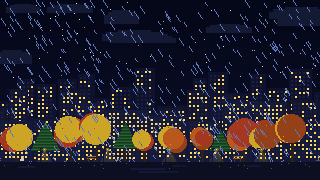
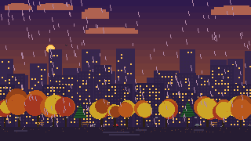
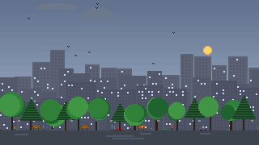
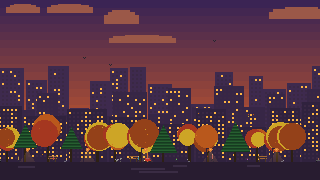
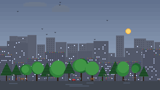

# dynamic-city-wallpaper

An animated pixel-art wallpaper for Wayland desktops. The scene reacts to live
weather (rain, snow, lightning, wind angle), time of day (dawn/day/dusk/evening/night),
season (summer/autumn/winter/spring), moon phase, and local holidays.

---

## Previews

| Night — spring (full moon) | Night — autumn (storm) |
|:---:|:---:|
|  |  |

| Dawn — winter rain | Day — summer | Dusk — autumn |
|:---:|:---:|:---:|
|  |  |  |

| Evening — winter aurora | |
|:---:|:---:|
|  | *aurora australis appears on clear winter nights* |

**Christmas** — lights and decorations appear automatically on Dec 18–25. Season follows
your hemisphere: southern users get a summer Christmas, northern users get a winter one.

| Christmas — winter (northern) | Christmas — summer (southern) |
|:---:|:---:|
|  |  |

---

## Features

- Weather-aware — fetches real conditions via [Open-Meteo](https://open-meteo.com/) (no API key needed)
- Time-of-day periods with smooth sun/moon arcs
- Seasonal trees: blossoms in spring, falling leaves in autumn, bare branches + snow in winter
- Aurora australis on clear winter nights
- Street life: people with umbrellas, cats, dogs, pigeons, vehicles, birds, planes
- Holiday decorations: Christmas lights, Easter eggs, New Year fireworks
- Configurable city layout — pick density and seed until you like what you see

## Requirements

| Dependency | Notes |
|------------|-------|
| Python 3.11+ | `tomllib` is stdlib from 3.11 |
| Pillow | `pip install Pillow` |
| `awww` or `swww` | Animated GIF wallpaper setter for Wayland |

`awww` is recommended ([github.com/horus645/awww](https://github.com/horus645/awww)).
`swww` works too ([github.com/LGFae/swww](https://github.com/LGFae/swww)).

## Quick start

```bash
git clone https://github.com/TheHomelessTwig/dynamic-city-wallpaper.git
cd dynamic-city-wallpaper

# Interactive setup — picks density, previews layout, writes config
python3 dynamic-city.py --init

# Install daemon (systemd service or Hyprland exec-once)
bash install.sh
```

## Configuration

`--init` writes `~/.config/dynamic-city/config.toml`. You can also copy and
edit `config.toml.example` manually.

```toml
[display]
resolution = "2560x1440"   # your monitor resolution

[location]
# lat = YOUR_LAT           # hard-code to skip IP geolocation
# lon = YOUR_LON

[city]
layout_seed      = 42      # change for a different city — same seed = same city
tree_density     = 6       # 1 (sparse) to 10 (dense forest)
building_density = 6       # 1 (scattered) to 10 (packed skyline)

[wallpaper]
setter     = "awww"        # awww | swww
transition = "wipe"

[services]
geo_provider     = "ipapi"       # ipapi | ip-api | ipinfo  (all free, no key)
weather_provider = "open-meteo"  # open-meteo (free) | openweathermap (key required)
# weather_api_key = ""
```

## Usage

```bash
# Interactive setup (run first)
python3 dynamic-city.py --init

# Preview a specific period with live weather
python3 dynamic-city.py --preview night
python3 dynamic-city.py --preview day

# Preview with forced conditions
python3 dynamic-city.py --preview night --rain 3 --lightning 1

# Start the daemon manually
bash daemon.sh

# Install as systemd service
bash install.sh

# Regenerate all five period GIFs into the current directory
python3 dynamic-city.py
```

## How it works

The daemon (`daemon.sh`) calls `--fetch-weather` on each wake cycle to get the
current period and conditions, then invokes the generator only if something has
changed. The generated GIF is cached in `/tmp/` by state key so identical
conditions reuse the existing file.

The generator renders a 320×180 pixel-art scene into 320 frames at 80 ms/frame,
then upscales to your monitor resolution. All scene elements use deterministic
RNG seeded by `layout_seed` for the city structure — the same config always
produces the same city.

## Hyprlock integration

The daemon writes `/tmp/dynamic_city_lock.png` (a static frame) whenever it
regenerates the GIF. Point hyprlock at it:

```ini
background {
    path        = /tmp/dynamic_city_lock.png
    blur_passes = 0
    brightness  = 0.75
    contrast    = 0.9
}
```

## Credits

Weather data: [Open-Meteo](https://open-meteo.com/) — free, no API key required.  
Geolocation: [ipapi.co](https://ipapi.co/) — used only if lat/lon not configured.
