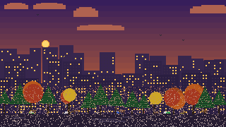
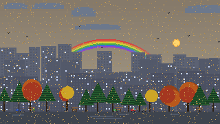
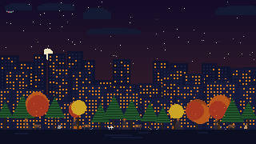
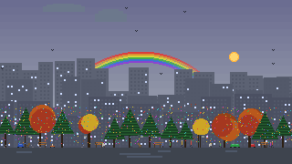
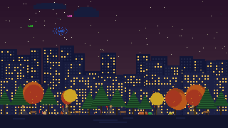

# dynamic-city-wallpaper

An animated pixel-art wallpaper for Wayland desktops. The scene reacts to live
weather, time of day, season, moon phase, and local holidays — and looks
different every time the daemon starts.

---

## Previews

| Night — spring (full moon) | Night — autumn (storm) |
|:---:|:---:|
|  |  |

| Dawn — winter rain | Day — summer | Dusk — autumn |
|:---:|:---:|:---:|
|  |  |  |

| Dawn — fog | Day — sandstorm |
|:---:|:---:|
|  |  |

| Evening — Aurora Australis / Borealis | |
|:---:|:---:|
|  | *appears on clear winter nights — probability scales outward from the equator, peaking near 70° in both hemispheres* |

### Holidays

| Halloween | Holi | Chinese New Year |
|:---:|:---:|:---:|
|  |  |  |

**Christmas** — lights, decorations, and reindeer appear automatically on Dec 18–25.

| Christmas — winter (northern) | Christmas — summer (southern) |
|:---:|:---:|
|  |  |

---

## Features

### Weather
- **Rain** — 4 intensity levels, wind-angled drops, puddle reflections, umbrellas
- **Snow** — drifting flakes, snow caps on trees and buildings
- **Fog** — ground-level haze rolling through the scene at dawn and dusk
- **Hail** — vertical white drops with bounce marks on the ground
- **Sandstorm** — horizontal streaming particles, sandy sky (OpenWeatherMap only)
- **Lightning** — bolt strikes with a flash effect
- **Rainbow** — 30% chance after rain clears on a bright day

### Time of day
Five periods with smooth sun/moon arcs: dawn, day, dusk, evening, night.

### Seasons
- **Spring** — cherry blossom petals drifting
- **Summer** — richer greens, fireflies at night, butterflies by day
- **Autumn** — orange/red trees, falling leaves, more foxes and squirrels
- **Winter** — bare branches, snow, frost on building ledges

Seasons are hemisphere-aware — southern users get summer in December.

### Street life

All creatures vary by time of day, season, and weather.

| Creature | Active | Notes |
|----------|--------|-------|
| People | all day | clothing tinted to match the current holiday |
| Birds | dawn–dusk | more in spring/summer |
| Pigeons | all day | flocks grow in spring/summer |
| Cats | evening/night | more in summer, fewer in winter |
| Dogs | day–evening | more walks in spring/summer |
| Foxes | evening/night | more common in autumn/winter |
| Squirrels | day–dusk | autumn-heavy (collecting nuts) |
| Butterflies | day, spring/summer | flutter among the trees |
| Ducks | day | more in rainy weather |
| Bats | evening/night | guaranteed on Halloween |
| Fireflies | evening/night, summer | rare summer blink |
| Reindeer | night/evening, Christmas | fly in formation across the sky |
| Plane | occasional | period-dependent |

### Holidays

Detected automatically by date. People's clothing shifts to match each holiday.

| Holiday | Date | Effect |
|---------|------|--------|
| Valentine's Day | Feb 14 | pink sky, floating hearts, red clothing |
| St Patrick's Day | Mar 17 | green sky, shamrocks on the ground, green clothing |
| Holi | full moon in March ±3 days | coloured powder particles, vivid clothing |
| Easter | Easter Sunday ±3 days | painted eggs on the ground |
| Chinese New Year | 2nd new moon after Dec 21 ±3 days | red sky, lanterns on streetlights, fireworks, red clothing |
| 4th of July | Jul 4 | fireworks |
| Halloween | Oct 24–31 | pumpkins, guaranteed bats, orange/purple sky, dark clothing |
| Guy Fawkes Night | Nov 5 | fireworks |
| Diwali | new moon in Oct/Nov ±3 days | golden sky, all windows lit, diya lamps, warm clothing |
| Christmas | Dec 18–25 | rooftop lights, reindeer, fireworks, red/green clothing |
| New Year | Dec 31–Jan 1 | fireworks |

### Other
- Moon phases cycle realistically
- Aurora Australis / Borealis — probability scales with latitude

---

## Requirements

| Dependency | Notes |
|------------|-------|
| Python 3.11+ | `tomllib` is stdlib from 3.11 |
| Pillow | `pip install Pillow` |
| `awww` or `swww` | Animated GIF wallpaper setter for Wayland |

`awww` is recommended ([github.com/horus645/awww](https://github.com/horus645/awww)).
`swww` works too ([github.com/LGFae/swww](https://github.com/LGFae/swww)).

## Quick start

```bash
git clone https://github.com/TheHomelessTwig/dynamic-city-wallpaper.git
cd dynamic-city-wallpaper

# Interactive setup — picks density, previews layout, writes config
python3 dynamic-city.py --init

# Install daemon (systemd service or Hyprland exec-once)
bash install.sh
```

## Configuration

`--init` writes `~/.config/dynamic-city/config.toml`. You can also copy and
edit `config.toml.example` manually.

```toml
[display]
resolution = "2560x1440"   # your monitor resolution

[location]
# lat = YOUR_LAT           # hard-code to skip IP geolocation
# lon = YOUR_LON

[city]
layout_seed      = 42      # change for a different city — same seed = same city
tree_density     = 6       # 1 (sparse) to 10 (dense forest)
building_density = 6       # 1 (scattered) to 10 (packed skyline)

[wallpaper]
setter     = "awww"        # awww | swww
transition = "wipe"

[services]
geo_provider     = "ipapi"       # ipapi | ip-api | ipinfo  (all free, no key)
weather_provider = "open-meteo"  # open-meteo (free) | openweathermap (key required)
# weather_api_key = ""
```

## Usage

```bash
# Interactive setup (run first)
python3 dynamic-city.py --init

# Preview a specific period with live weather
python3 dynamic-city.py --preview night
python3 dynamic-city.py --preview day

# Preview with forced conditions
python3 dynamic-city.py --preview night --rain 3 --lightning 1
python3 dynamic-city.py --preview dawn --fog 1
python3 dynamic-city.py --preview day --sandstorm 1

# Preview a holiday
python3 dynamic-city.py --preview night --holiday halloween
python3 dynamic-city.py --preview evening --holiday cny
python3 dynamic-city.py --preview day --holiday holi
# Other holiday values: newyear, easter, valentines, stpatricks,
#                       diwali, july4, guyfawkes, christmas

# Start the daemon manually
bash daemon.sh

# Install as systemd service
bash install.sh

# Regenerate all five period GIFs into the current directory
python3 dynamic-city.py
```

## How it works

The daemon (`daemon.sh`) calls `--fetch-weather` on each wake cycle to get the
current period and conditions, then invokes the generator only if something has
changed. The generated GIF is cached in `/tmp/` by state key so identical
conditions reuse the existing file.

The generator renders a 320×180 pixel-art scene into 320 frames at 80 ms/frame,
then upscales to your monitor resolution. City structure (buildings, trees,
street furniture) is deterministic — seeded by `layout_seed` so the same config
always produces the same skyline. Street life (creatures, aurora, rainbow) is
re-randomised each time the daemon starts, so the scene looks different across
reboots.

**Device load:** the GIF render takes ~10 seconds on one CPU core when conditions
change, then the process exits. Playback is handled entirely by the wallpaper
setter in composited GPU memory — no CPU cost at runtime. Between regenerations
(typically 30 minutes to several hours) the daemon does nothing but sleep.

## Hyprlock integration

The daemon writes `/tmp/dynamic_city_lock.png` (a static frame) whenever it
regenerates the GIF. Point hyprlock at it:

```ini
background {
    path        = /tmp/dynamic_city_lock.png
    blur_passes = 0
    brightness  = 0.75
    contrast    = 0.9
}
```

## Credits

Weather data: [Open-Meteo](https://open-meteo.com/) — free, no API key required.  
Geolocation: [ipapi.co](https://ipapi.co/) — used only if lat/lon not configured.
